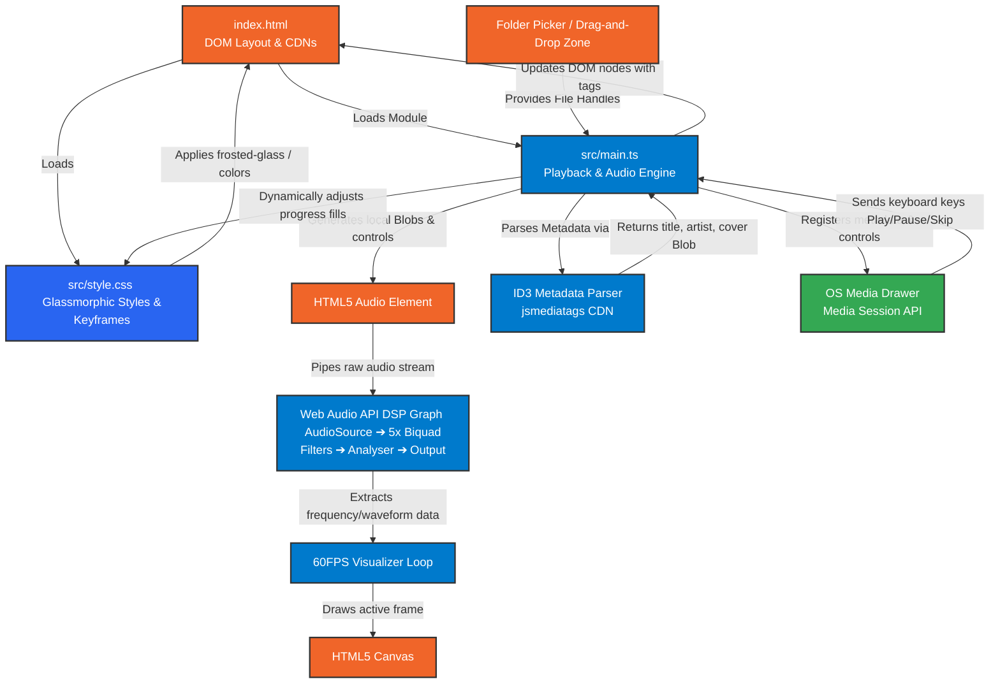

# Vibe Player - Architecture & Workflow
 

This document explains the architecture, file communication, and workflow of the Vibe Player application. It describes how the HTML, CSS, and TypeScript modules interact to create a real-time, hardware-integrated local audio hub.

---

## 🗺️ Workflow and Connection Tree

The diagram below illustrates the relationship between the front-end layout structure, the styling engine, the core TypeScript logic, and the Web Audio digital signal processing (DSP) pipeline:

---

## 🔗 File Communications

### 1. HTML (`index.html`) — *The Skeleton and Entry Point*
*   **Structure**: It defines the 3-panel layout (Sidebar, Center Player, Right Dashboard) and interactive DOM controls (buttons, custom range sliders, canvas, and file inputs).
*   **Bridge to TS**: Loads `src/main.ts` as an ES module (`type="module"`). Vite reads this entry point and bundles all imported resources automatically.
*   **Bridge to CSS**: Imports the style module using Vite assets resolving mechanism, applying the core visual layouts.
*   **External Assets**: Links the Outfit/Inter Google fonts and the `jsmediatags` library via CDN.

### 2. CSS (`src/style.css`) — *The Aesthetic and Layout System*
*   **Theme & Glassmorphism**: Defines custom CSS variables (`--color-primary`, `--shadow-glass`, etc.), frosted-glass layers using `backdrop-filter: blur()`, and animated backgrounds.
*   **Responsive Grid**: Manages transitions for screen layouts. On mobile screens, it hides the Sidebar and Dashboard and shifts them off-canvas.
*   **Bridge to TS**: TS queries the layout classes to show/hide menus (e.g. `.show` class on sidebar). TS also writes inline styles directly to CSS variables to update the track progress bar fill (`--seek-progress-fill`) and volume tracks.

### 3. TypeScript (`src/main.ts`) — *The Brain and Engine*
*   **Event Handling**: Targets the DOM elements defined in HTML (`document.getElementById`) and attaches listeners for folder loading, playback clicks, search filtering, and slider drags.
*   **Audio DSP Pipeline**: Sets up the Web Audio API connection. It routes the browser `<audio>` node stream through a chain of five physical filter nodes (`BiquadFilterNode`) acting as the 5-band Equalizer, then pipes it to an `AnalyserNode` which captures raw frequency data.
*   **Canvas Painting**: Obtains a 2D context of the HTML5 `<canvas>` and runs a 60fps `requestAnimationFrame` loop. It samples the audio analyser's spectrum data and calculates pixels to draw bars, waves, or circular ripples.
*   **Data Integration**: Acts as the orchestrator: 
    *   Reads the local files -> outputs standard object URLs -> passes them to the HTML audio tag.
    *   Funnels parsed metadata from `jsmediatags` back to the HTML display.
    *   Sends metadata and listens for key actions from the browser's OS Media session.
